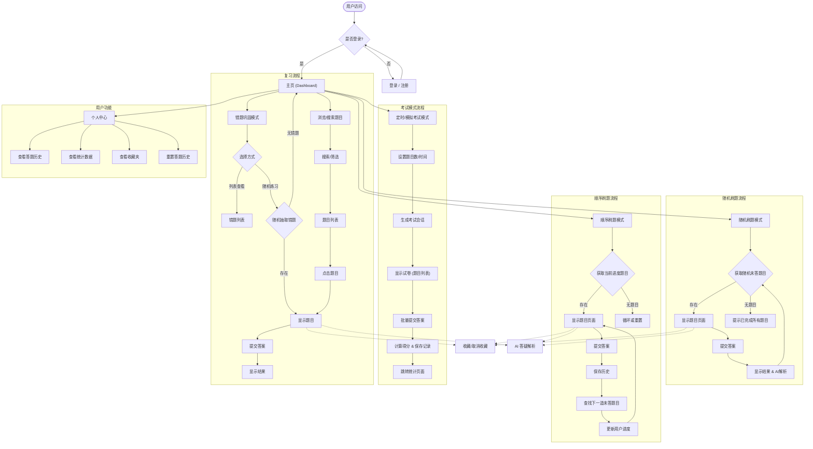

```mermaid
flowchart TD
    %% 核心流程入口
    Start([用户访问]) --> AuthCheck{是否登录?}
    AuthCheck -- 否 --> LoginReg["登录 / 注册"]
    LoginReg --> AuthCheck
    AuthCheck -- 是 --> Index["主页 (Dashboard)"]

    %% 主功能模块
    Index --> RandomMode["随机刷题模式"]
    Index --> SeqMode[顺序刷题模式]
    Index --> ExamMode["定时/模拟考试模式"]
    Index --> WrongMode["错题巩固模式"]
    Index --> BrowseMode["浏览/搜索题目"]
    Index --> UserCenter[个人中心]

    %% 随机刷题逻辑
    subgraph RandomLogic [随机刷题流程]
        RandomMode --> GetRand{获取随机未答题目}
        GetRand -- 存在 --> ShowRandQ[显示题目页面]
        GetRand -- 无题目 --> RandFinish[提示已完成所有题目]
        ShowRandQ --> SubmitRand[提交答案]
        SubmitRand --> ShowRandResult["显示结果 & AI解析"]
        ShowRandResult --> GetRand
    end

    %% 顺序刷题逻辑
    subgraph SeqLogic [顺序刷题流程]
        SeqMode --> GetSeq{获取当前进度题目}
        GetSeq -- 存在 --> ShowSeqQ[显示题目页面]
        GetSeq -- 无题目 --> SeqFinish[循环或重置]
        ShowSeqQ --> SubmitSeq[提交答案]
        SubmitSeq --> SaveSeqHist[保存历史]
        SaveSeqHist --> FindNextSeq[查找下一道未答题目]
        FindNextSeq --> UpdateProgress[更新用户进度]
        UpdateProgress --> ShowSeqQ
    end

    %% 考试模式逻辑
    subgraph ExamLogic [考试模式流程]
        ExamMode --> ConfigExam["设置题目数/时间"]
        ConfigExam --> InitExam["生成考试会话"]
        InitExam --> ShowExamPaper["显示试卷 (题目列表)"]
        ShowExamPaper --> SubmitExam["批量提交答案"]
        SubmitExam --> CalcScore["计算得分 & 保存记录"]
        CalcScore --> ShowStats["跳转统计页面"]
    end

    %% 错题/浏览逻辑
    subgraph ReviewLogic [复习流程]
        WrongMode --> WrongType{选择方式}
        WrongType -- 列表查看 --> ListWrong[错题列表]
        WrongType -- 随机练习 --> GetWrong{随机抽取错题}
        GetWrong -- 存在 --> ShowReviewQ[显示题目]
        GetWrong -- 无错题 --> Index
        
        BrowseMode --> SearchFilter["搜索/筛选"]
        SearchFilter --> ListQs["题目列表"]
        ListQs --> ClickQ[点击题目]
        ClickQ --> ShowReviewQ
        
        ShowReviewQ --> SubmitReview[提交答案]
        SubmitReview --> ShowReviewResult[显示结果]
    end

    %% 个人中心与辅助功能
    subgraph UserFeatures [用户功能]
        UserCenter --> ViewHistory[查看答题历史]
        UserCenter --> ViewStats[查看统计数据]
        UserCenter --> ViewFav[查看收藏夹]
        UserCenter --> ResetHist[重置答题历史]
    end

    %% 通用功能 (题目页)
    ShowRandQ & ShowSeqQ & ShowReviewQ -.-> ToggleFav["收藏/取消收藏"]
    ShowRandQ & ShowSeqQ & ShowReviewQ -.-> AskAI[AI 答疑解析]
```
