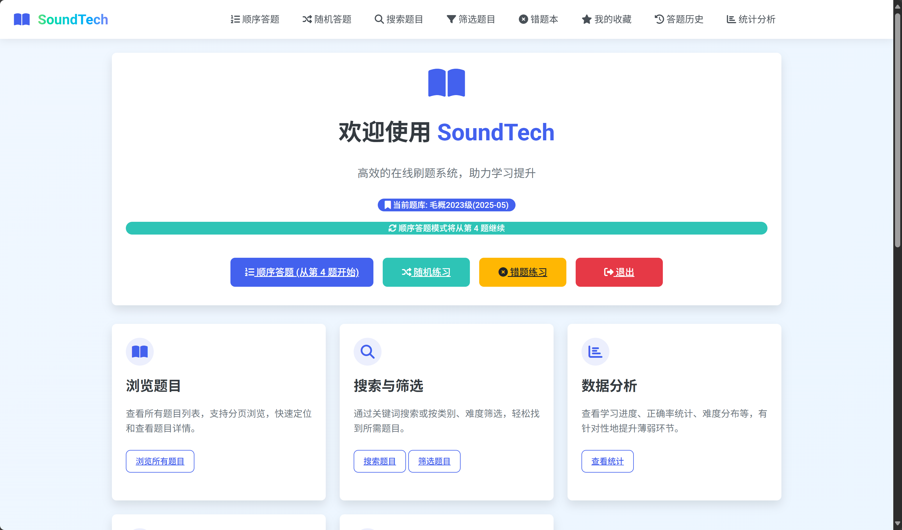
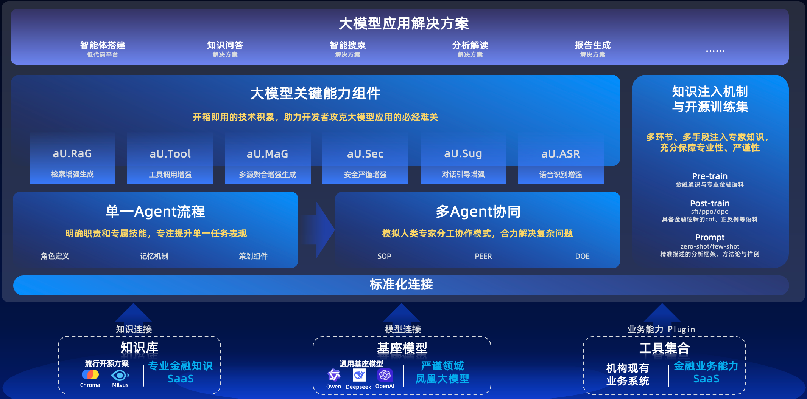
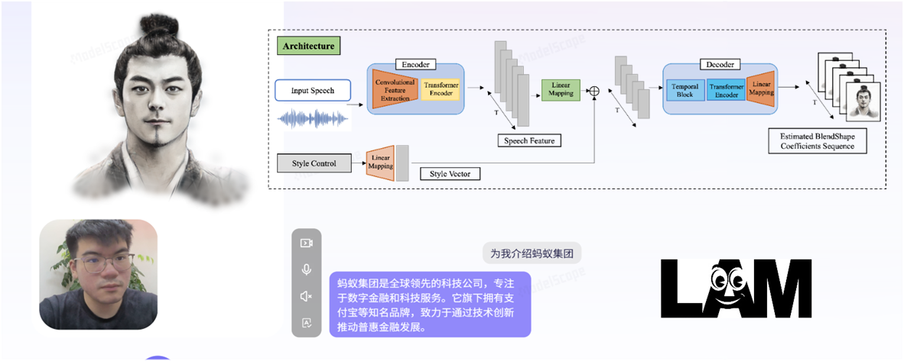
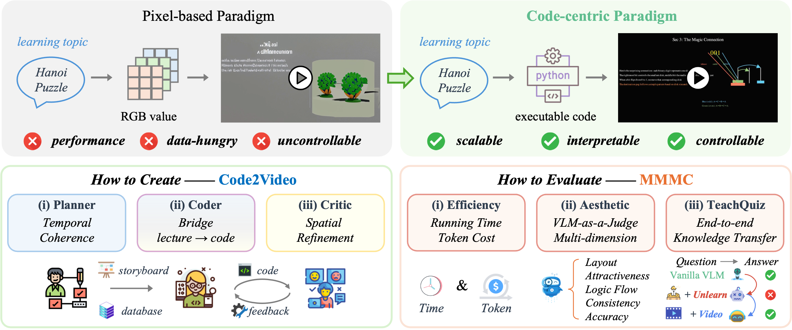

### 需求规格说明书
##### SoundTech® by Dingdust 2025.10.13
---
软件需求来源
1. 2025"蚂蚁·数字马力杯"第十二届浙江省大学生服务外包创新应用大赛-A02赛题

> 随着人工智能技术与教育领域的深度融合，学习场景正经历深刻变革。
> 在信息爆炸时代，知识更新速度极快，学习者面临海量信息筛选与高效吸收的难题。
> 传统 “千人一面” 的学习模式难以匹配个体学习节奏与偏好，
> 学习过程中存在的孤独感、缺乏即时反馈与个性化指导等问题，
> 也严重阻碍了学习者的进步。
> 在此形势下，亟需借助人工智能技术，为学习者提供更贴合需求的学习支持。

> 为解决高校学生学习者面临的诸多痛点，
> “AI智能・学习搭子” 项目以人工智能技术为核心，
> 致力于打造一款高度个性化、交互性强的智能学习伙伴。
> 通过自然语言处理、机器学习、数据分析等前沿AI技术，
> 模拟真实学习伙伴的陪伴、引导与辅助功能，
> 实现学习规划定制、知识答疑、进度追踪、心理激励等多元化服务，
> 为学习者构建沉浸式、自适应的学习环境，助力提升学习效率与体验，
> 推动教育向智能化、个性化方向发展。

2. 浙江工商大学东方语言与哲学学院日语系-张晓东老师

> 通过AI工具赋能，建设多模态教学资源，提升日语教学效果。

3. 浙江工商大学数字化办公室-我的商大APP【AI学伴】功能

> 利用RAG知识图谱技术，搭建多模态教学资源库；
> 搭建数字人功能，实现数字教师的授课与同学习者的实时互动。

---
软件研发目标
1. 搭建一个基本的【答题平台】，实现以下功能：

- 具有一个选择题题库，题库中涵盖多道题目，可通过csv/excel文件导入；
- 题库包含题目描述和选项、难度、分类、答案等；
- 用户可自行注册并登录系统进行答题；
- 用户答题后，后台记录用户答题信息；
- 用户可查看答题情况，如正确率、错题等。
- 仅在用户登陆后才可答题/查看相关信息。 

| 功能          | 功能说明                           |
| ------------ | --------------------------------- |
| 用户登录      | 用户登录                           |
| 用户注册      | 用户注册                           |
| 用户答题      | 包含顺序答题、乱序答题、定时/定量答题等 |
| 搜索筛选      | 根据关键字/题目类别筛选/查看/导出题目  |
| 收藏/错题本   | 查看/导出用户收藏/答错的题目          |
| 数据分析      | 展示正确率、个人答题记录等信息        |

2. 在【答题平台】中添加【AI题目答疑】功能，并增加用户RAG知识库功能
   
- 基于用户答题记录，利用RAG知识图谱技术，构建用户个性化知识库；
- 用户可以自定义个人知识库的构建与管理；
- 用户可以在【AI题目答疑】功能中，基于个人知识库进行问题答疑。

3. 在【答题平台】中添加【数字人交互】功能，即对【AI题目答疑】进行可视化实现

- 基于ASR语音识别技术，实现用户与数字人之间的语音交互；
- 基于RAG知识图谱技术，实现数字人对用户问题的理解与回答；
- 基于TTS语音合成技术，实现数字人对用户的语音回复；
- 基于数字人交互功能，实现回复的数字人形态可视化。

4. 面向计算机学科，打造一个【AI智慧授课】综合平台，实现智能授课与答疑

- 基于编程代码，自动生成对应的算法讲解视频；
- 基于课程知识，自动生成对应的数字人课程视频。

