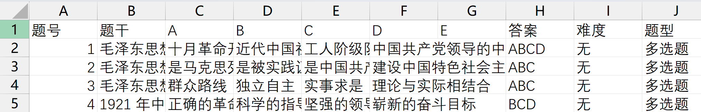
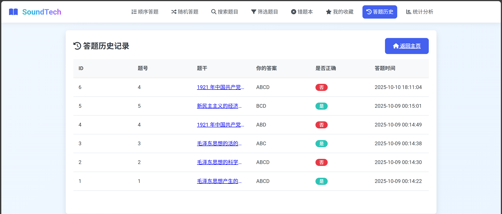
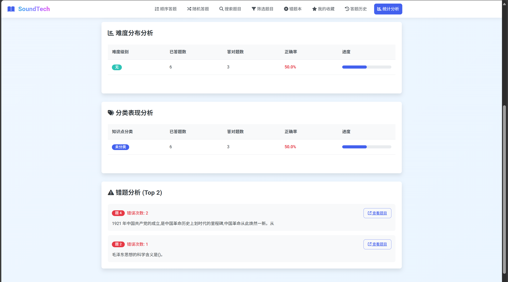
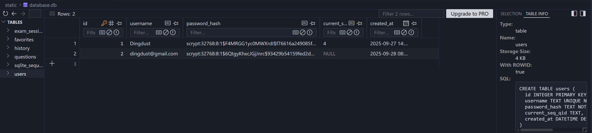

### 需求规格说明书
##### SoundTech® by Dingdust 2025.10.13
---
软件需求来源
1. 2025"蚂蚁·数字马力杯"第十二届浙江省大学生服务外包创新应用大赛-A02赛题

> 随着人工智能技术与教育领域的深度融合，学习场景正经历深刻变革。
> 在信息爆炸时代，知识更新速度极快，学习者面临海量信息筛选与高效吸收的难题。
> 传统 “千人一面” 的学习模式难以匹配个体学习节奏与偏好，
> 学习过程中存在的孤独感、缺乏即时反馈与个性化指导等问题，
> 也严重阻碍了学习者的进步。
> 在此形势下，亟需借助人工智能技术，为学习者提供更贴合需求的学习支持。

> 为解决高校学生学习者面临的诸多痛点，
> “AI智能・学习搭子” 项目以人工智能技术为核心，
> 致力于打造一款高度个性化、交互性强的智能学习伙伴。
> 通过自然语言处理、机器学习、数据分析等前沿AI技术，
> 模拟真实学习伙伴的陪伴、引导与辅助功能，
> 实现学习规划定制、知识答疑、进度追踪、心理激励等多元化服务，
> 为学习者构建沉浸式、自适应的学习环境，助力提升学习效率与体验，
> 推动教育向智能化、个性化方向发展。

2. 浙江工商大学东方语言与哲学学院日语系-张晓东老师

> 通过AI工具赋能，建设多模态教学资源，提升日语教学效果。

3. 浙江工商大学数字化办公室-我的商大APP【AI学伴】功能

> 利用RAG知识图谱技术，搭建多模态教学资源库；
> 搭建数字人功能，实现数字教师的授课与同学习者的实时互动。

---
软件研发目标
1. 搭建一个基本的【答题平台】，实现以下功能：

- 具有一个选择题题库，题库中涵盖多道题目，可通过csv/excel文件导入（如下图所示）；
- 
- 题库包含题目描述和选项、难度、分类、答案等；
- 用户可自行注册并登录系统进行答题；
- 用户答题后，后台记录用户答题信息；
- 
- 用户可查看答题情况，如正确率、错题等。
- 
- 仅在用户登陆后才可答题/查看相关信息。 

| 功能              | 功能说明                                       |
| ----------------- | ----------------------------------------------- |
| 用户登录/登出      | 登录/退出，未登录访问重定向到登录页面             |
| 用户注册          | 用户名唯一，密码哈希存储                         |
| 主页与模式选择     | 主页展示顺序练习进度；支持模式选择（modes）        |
| 题目浏览与分页     | 浏览题目列表，分页；支持类型过滤与关键词搜索       |
| 题目搜索          | 按关键词搜索题目（参数化查询防 SQL 注入）          |
| 题目过滤          | 按类别、难度等多维条件筛选题目                     |
| 指定题目答题       | 查看题目详情并提交答案，即时反馈正确/错误           |
| 随机答题          | 随机抽取未作答题目进行练习                         |
| 顺序答题          | 顺序练习并支持断点续练（记录 current_seq_qid）     |
| 错题练习/错题本     | 仅练习错题（only_wrong）；查看错题集合（wrong）      |
| 收藏管理          | 收藏/取消收藏；收藏唯一性约束（同一题不重复收藏）     |
| 历史记录与重置     | 查看个人答题历史；支持重置历史以重新开始             |
| 定时模式          | 自定义题量与时长的定时练习，会话记录支持提交         |
| 考试模式          | 考试会话管理与试题提交，统计得分                    |
| 数据分析          | 展示总体正确率、难度/类别分析、近期考试与薄弱题目     |
| 题库管理          | CSV 批量导入（resources/questions.csv）；选项以 JSON 存储 |

功能细化：

- 数据项定义（题库与记录）
  - questions：id、stem、answer、difficulty、qtype、category、options(JSON)、created_at。
  
  - history：user_id、question_id、user_answer、correct、timestamp（支持历史查看与重置）。
  
  - favorites：UNIQUE(user_id, question_id) 约束；tag（可选）、created_at。
  
  - exam_sessions：mode（exam/timed）、question_ids(JSON)、start_time、duration、completed、score。
  

  
- 访问控制与安全
  - 仅登录后可访问答题、浏览、搜索、过滤、收藏、历史、统计、模式页面。
  - 会话管理采用 `session['user_id']`；未登录访问重定向到登录页并携带 next 参数。
  - 密码使用哈希存储；所有查询采用参数化语句防止 SQL 注入。
  
- 导入与数据来源
  - 支持通过 CSV 批量导入题库；当前版本推荐使用 `resources/questions.csv`。
  - 提供脚本 `tools/convert_txt_csv.py` 进行格式转换；Excel 可先转换为 CSV 后导入。

* 非功能需求：

  >  技术选型
  >  Python —— 考虑东语学院需求 / 团队技术栈 / 接口注入等
  >  Flask + waitress / uWSGI —— 轻量化内核
  >  csv文件直接存储（RAG交互等） + Sqlite （工程持久化备份）
  >  使用OpenSSL进行SSL证书申请 —— 域名 + HTTPS
  >  前端HTML + JavaScript + CSS —— 模板分离，直观修改、复用性

  * 支持在10秒内100个用户的同时并发访问（浙江工商大学东方语言与哲学学院教学实际需要）

  * HTML模板分离、可复用设计（浙江工商大学东方语言与哲学学院开发复用需要）

2. 在【答题平台】中添加【AI题目答疑】功能，并增加用户RAG知识库功能
   
- 基于用户答题记录，利用RAG知识图谱技术，构建用户个性化知识库；
- 用户可以自定义个人知识库的构建与管理；
- 用户可以在【AI题目答疑】功能中，基于个人知识库进行问题答疑。

3. 在【答题平台】中添加【数字人交互】功能，即对【AI题目答疑】进行可视化实现

- 基于ASR语音识别技术，实现用户与数字人之间的语音交互；
- 基于RAG知识图谱技术，实现数字人对用户问题的理解与回答；
- 基于TTS语音合成技术，实现数字人对用户的语音回复；
- 基于数字人交互功能，实现回复的数字人形态可视化。

4. 面向计算机学科，打造一个【AI智慧授课】综合平台，实现智能授课与答疑

- 基于编程代码，自动生成对应的算法讲解视频；
- 基于课程知识，自动生成对应的数字人课程视频。

