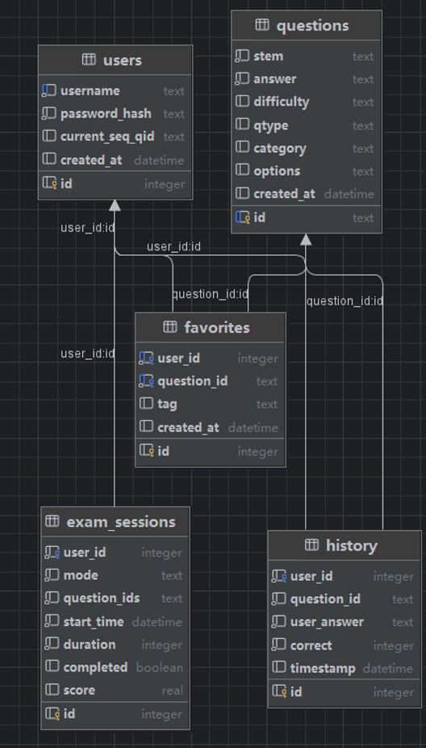

# SoundTech 数据库设计文档

> 基于 SQLite 的智能题库学习系统数据库设计

---

## 📖 项目概述

SoundTech 是一个基于 Flask 框架开发的智能题库学习系统，旨在为用户提供高效、个性化的在线学习体验。系统支持多种学习模式，包括顺序练习、随机练习、错题回顾、考试模拟等功能。

### 技术栈
- **数据库**: SQLite 3
- **后端框架**: Flask 3.1.2
- **数据格式**: JSON + CSV
- **安全**: 密码哈希 + Session 管理

---

## 🎯 需求分析

### 业务需求

#### 1. 用户管理需求
- **用户注册与登录**: 支持用户账号创建、身份验证
- **学习进度跟踪**: 记录用户当前学习位置
- **个人数据管理**: 保存用户的学习偏好和设置

#### 2. 题库管理需求
- **题目存储**: 支持多种题型（单选、多选、判断等）
- **灵活选项**: 支持可变数量的选项（A-E）
- **分类管理**: 按难度、类别、题型分类
- **批量导入**: 支持 CSV 格式批量导入题目

#### 3. 学习功能需求
- **多种学习模式**: 顺序、随机、错题、考试模式
- **答题记录**: 详细记录每次答题情况
- **收藏功能**: 支持题目收藏和标签管理
- **统计分析**: 提供学习数据统计和分析

#### 4. 考试功能需求
- **考试会话**: 支持限时考试和计时练习
- **成绩管理**: 记录考试成绩和完成状态
- **灵活配置**: 支持自定义考试时长和题目数量

### 技术需求

#### 1. 数据一致性
- 确保用户数据和答题记录的一致性
- 维护题目和选项数据的完整性
- 保证考试会话数据的准确性

#### 2. 性能要求
- 支持快速题目检索和随机抽取
- 优化大量历史记录的查询性能
- 确保并发用户访问的响应速度

#### 3. 扩展性要求
- 支持题库规模的动态扩展
- 适应新题型和功能的添加
- 便于系统功能的迭代升级

---

## 🏗️ 数据库架构设计

### 架构原则

1. **单一职责原则**: 每个表负责特定的业务领域
2. **数据规范化**: 避免数据冗余，确保数据一致性
3. **灵活性设计**: 使用 JSON 存储可变结构数据
4. **性能优化**: 合理设计索引和查询策略

### 整体架构

```
┌─────────────────┐    ┌─────────────────┐    ┌─────────────────┐
│     users       │    │   questions     │    │    history      │
│   (用户表)       │    │   (题目表)       │    │  (答题历史表)    │
│                 │    │                 │    │                 │
│ • id (PK)       │    │ • id (PK)       │    │ • id (PK)       │
│ • username      │◄───┤ • stem          │◄───┤ • user_id (FK)  │
│ • password_hash │    │ • options (JSON)│    │ • question_id   │
│ • current_seq   │    │ • answer        │    │ • user_answer   │
│ • created_at    │    │ • difficulty    │    │ • correct       │
└─────────────────┘    │ • qtype         │    │ • timestamp     │
         │              │ • category      │    └─────────────────┘
         │              └─────────────────┘             │
         │                       │                      │
         │              ┌─────────────────┐             │
         │              │   favorites     │             │
         │              │   (收藏表)       │             │
         │              │                 │             │
         └──────────────┤ • id (PK)       │             │
                        │ • user_id (FK)  │             │
                        │ • question_id   │             │
                        │ • tag           │             │
                        │ • created_at    │             │
                        └─────────────────┘             │
                                 │                      │
                        ┌─────────────────┐             │
                        │ exam_sessions   │             │
                        │  (考试会话表)    │             │
                        │                 │             │
                        │ • id (PK)       │◄────────────┘
                        │ • user_id (FK)  │
                        │ • mode          │
                        │ • question_ids  │
                        │ • start_time    │
                        │ • duration      │
                        │ • completed     │
                        │ • score         │
                        └─────────────────┘
```




---

## 📊 表结构设计

### 1. users 表 - 用户信息

```sql
CREATE TABLE users (
    id INTEGER PRIMARY KEY AUTOINCREMENT,
    username TEXT UNIQUE NOT NULL,
    password_hash TEXT NOT NULL,
    current_seq_qid TEXT,
    created_at DATETIME DEFAULT CURRENT_TIMESTAMP
);
```

#### 字段说明
| 字段名 | 类型 | 约束 | 说明 |
|--------|------|------|------|
| id | INTEGER | PRIMARY KEY | 用户唯一标识 |
| username | TEXT | UNIQUE NOT NULL | 用户名，唯一性约束 |
| password_hash | TEXT | NOT NULL | 密码哈希值，安全存储 |
| current_seq_qid | TEXT | NULL | 当前顺序练习位置 |
| created_at | DATETIME | DEFAULT | 账号创建时间 |

#### 设计考虑
- **安全性**: 使用 `password_hash` 存储加密后的密码
- **用户体验**: `current_seq_qid` 支持断点续练功能
- **唯一性**: `username` 确保用户名不重复

### 2. questions 表 - 题目信息

```sql
CREATE TABLE questions (
    id TEXT PRIMARY KEY,
    stem TEXT NOT NULL,
    answer TEXT NOT NULL,
    difficulty TEXT,
    qtype TEXT,
    category TEXT,
    options TEXT, -- JSON stored options
    created_at DATETIME DEFAULT CURRENT_TIMESTAMP
);
```

#### 字段说明
| 字段名 | 类型 | 约束 | 说明 |
|--------|------|------|------|
| id | TEXT | PRIMARY KEY | 题目编号，支持自定义格式 |
| stem | TEXT | NOT NULL | 题目内容/题干 |
| answer | TEXT | NOT NULL | 正确答案 |
| difficulty | TEXT | NULL | 难度等级（简单/中等/困难） |
| qtype | TEXT | NULL | 题目类型（单选/多选/判断） |
| category | TEXT | NULL | 题目分类 |
| options | TEXT | NULL | 选项内容（JSON 格式） |
| created_at | DATETIME | DEFAULT | 题目创建时间 |

#### JSON 选项格式
```json
{
    "A": "选项A内容",
    "B": "选项B内容", 
    "C": "选项C内容",
    "D": "选项D内容"
}
```

#### 设计优势
- **灵活性**: JSON 格式支持可变数量的选项
- **扩展性**: 易于添加新的题目属性
- **兼容性**: 支持多种题型和格式

### 3. history 表 - 答题历史

```sql
CREATE TABLE history (
    id INTEGER PRIMARY KEY AUTOINCREMENT,
    user_id INTEGER NOT NULL,
    question_id TEXT NOT NULL,
    user_answer TEXT NOT NULL,
    correct INTEGER NOT NULL,
    timestamp DATETIME DEFAULT CURRENT_TIMESTAMP,
    FOREIGN KEY (user_id) REFERENCES users(id)
);
```

#### 字段说明
| 字段名 | 类型 | 约束 | 说明 |
|--------|------|------|------|
| id | INTEGER | PRIMARY KEY | 记录唯一标识 |
| user_id | INTEGER | NOT NULL, FK | 用户ID，外键关联 |
| question_id | TEXT | NOT NULL | 题目ID |
| user_answer | TEXT | NOT NULL | 用户答案 |
| correct | INTEGER | NOT NULL | 是否正确（0/1） |
| timestamp | DATETIME | DEFAULT | 答题时间 |

#### 功能支持
- **学习轨迹**: 完整记录用户答题过程
- **错题分析**: 支持错题统计和回顾
- **进度跟踪**: 计算学习完成度

### 4. favorites 表 - 收藏管理

```sql
CREATE TABLE favorites (
    id INTEGER PRIMARY KEY AUTOINCREMENT,
    user_id INTEGER NOT NULL,
    question_id TEXT NOT NULL,
    tag TEXT,
    created_at DATETIME DEFAULT CURRENT_TIMESTAMP,
    UNIQUE(user_id, question_id),
    FOREIGN KEY (user_id) REFERENCES users(id),
    FOREIGN KEY (question_id) REFERENCES questions(id)
);
```

#### 字段说明
| 字段名 | 类型 | 约束 | 说明 |
|--------|------|------|------|
| id | INTEGER | PRIMARY KEY | 收藏记录ID |
| user_id | INTEGER | NOT NULL, FK | 用户ID |
| question_id | TEXT | NOT NULL, FK | 题目ID |
| tag | TEXT | NULL | 自定义标签 |
| created_at | DATETIME | DEFAULT | 收藏时间 |

#### 约束设计
- **唯一性**: `UNIQUE(user_id, question_id)` 防止重复收藏
- **引用完整性**: 外键确保数据一致性
- **标签系统**: 支持个性化分类管理

### 5. exam_sessions 表 - 考试会话

```sql
CREATE TABLE exam_sessions (
    id INTEGER PRIMARY KEY AUTOINCREMENT,
    user_id INTEGER NOT NULL,
    mode TEXT NOT NULL, -- 'exam' or 'timed'
    question_ids TEXT NOT NULL, -- JSON list
    start_time DATETIME NOT NULL,
    duration INTEGER NOT NULL, -- seconds
    completed BOOLEAN DEFAULT 0,
    score REAL,
    FOREIGN KEY (user_id) REFERENCES users(id)
);
```

#### 字段说明
| 字段名 | 类型 | 约束 | 说明 |
|--------|------|------|------|
| id | INTEGER | PRIMARY KEY | 会话ID |
| user_id | INTEGER | NOT NULL, FK | 用户ID |
| mode | TEXT | NOT NULL | 模式（exam/timed） |
| question_ids | TEXT | NOT NULL | 题目ID列表（JSON） |
| start_time | DATETIME | NOT NULL | 开始时间 |
| duration | INTEGER | NOT NULL | 时长（秒） |
| completed | BOOLEAN | DEFAULT 0 | 是否完成 |
| score | REAL | NULL | 得分 |

#### JSON 题目列表格式
```json
["1", "15", "23", "42", "56"]
```

---

