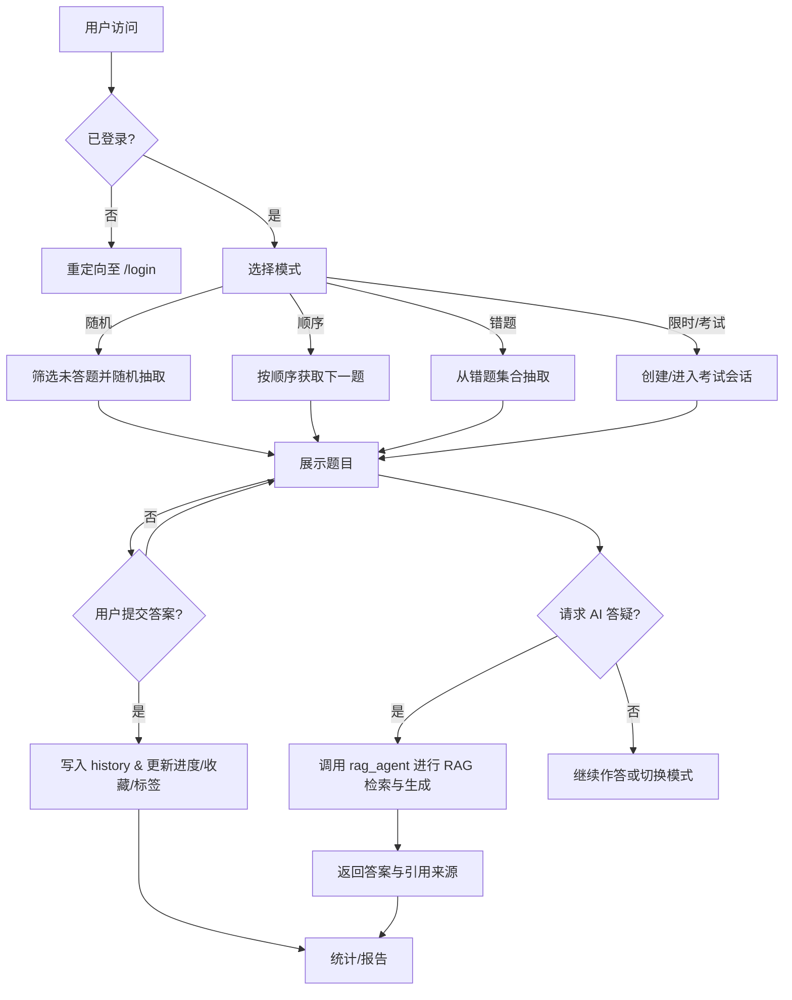

# 软件著作权申请材料（SoundTech）

## 一、软件总体功能
- 提供题库学习与测评：随机/顺序练习、错题复盘、收藏与标签、筛选与搜索、限时模式与考试会话。
- 智能答疑：基于课程资料与用户历史的 RAG 检索与生成，支持按题目 ID 调用 AI 解答，并引用知识来源。
- 学习数据管理：记录答题历史、进度与统计分析，输出学习报告与个人化建议。
- 用户管理与权限：注册、登录、登出、基于会话的访问控制。

## 二、软件编译与运行环境
- 操作系统：Windows 10/11（兼容 Linux/macOS）。
- 语言与运行时：Python 3.10+。
- 核心依赖：`Flask`、`sqlite3`、`agentUniverse==0.0.18`、`langchain` 相关组件、`langsmith`、`jieba`。
- 配置文件：`config/config.toml`（模块加载、会话记忆、日志与密钥路径）。
- 数据与静态资源：`static/database.db`（SQLite）、`static/chroma.sqlite3`（向量存储）、`resources/questions.csv`（题库源）。
- 启动方式：`python app.py`（默认本地运行，Jinja 模板渲染 Web UI）。

## 三、主要算法与实现机制
- RAG 检索生成：
  - 文本切分与索引构建（`langchain-text-splitters`），双存储：`maoist_chroma_store`（向量）+ `maoist_sqlite_store`（结构化）由 `handlers/vector_db_init.py` 驱动。
  - 召回与重排：依据题目语境检索相似片段，再进行答案生成并返回参考来源。
- 题目选择算法：
  - 随机模式：`SELECT id FROM questions ORDER BY RANDOM() LIMIT 1`，避开用户已答题（`history` 排除）。
  - 顺序模式：维护 `users.current_seq_qid`，按递增/指定顺序推进。
  - 错题模式：基于 `history.correct=0` 集合抽取与练习。
- 统计与评分：
  - 记录 `history(user_id, question_id, user_answer, correct)`，派生答题率、正确率、错题分布与标签偏好；考试会话记录在 `exam_sessions`。
- 安全与鲁棒：
  - 登录态基于 `session['user_id']`；密码哈希存储；SQL 均使用参数化查询；未授权访问重定向到登录页。

## 四、接口设计（路由与模块）
- 身份与会话：`/register`、`/login`、`/logout`；装饰器 `handlers/authentication.login_required` 控制保护路由访问。
- 学习主流程：`/`（首页）、`/random`、`/question/<qid>`、`/sequential_start`、`/sequential/<qid>`。
- 管理与复盘：`/history`、`/wrong`、`/only_wrong`、`/favorites`、`/favorite/<qid>`、`/unfavorite/<qid>`、`/update_tag/<qid>`。
- 检索与筛选：`/search`（关键词）、`/filter`（按类型/难度/类别/标签）。
- AI答疑：`/ai_answer/<qid>` 调用 `AgentUniverse/AgentManager` 的 `rag_agent`，基于教材与历史进行答案生成。
- 模块分层：
  - 路由层：`app.py`
  - 认证层：`handlers/authentication.py`
  - 数据层：`handlers/database.py`（SQLite、CSV 导入）
  - 知识与向量层：`handlers/vector_db_init.py` + `agentic/*` 配置与存储
  - 前端层：`templates/*.html` + `static/style.css`

## 五、软件流程描述
- 用户访问受保护页面时进行登录检查，未登录则重定向到 `/login`。
- 登录后选择学习模式（随机、顺序、错题、限时/考试）。
- 系统从 `questions` 表选择题目；用户提交答案后写入 `history` 并更新进度/收藏/标签。
- 若调用 AI 答疑，系统将根据题目语境与教材进行检索，生成解答与引用来源返回至前端。
- 用户可在历史与统计页面查看学习数据，进行复盘和强化。

---

## 六、软件总体流程图（Mermaid）


## 七、接口模块流程图（Mermaid）
```mermaid
flowchart LR
    subgraph Web
      UI[Templates/Jinja] --> RT[Flask Routes]
    end

    RT --> AUTH[authentication.login_required]
    RT --> DB[handlers.database]
    RT --> RAG[AgentUniverse + rag_agent]

    DB --> SQLITE[(static/database.db)]
    RAG --> VDB[(static/chroma.sqlite3)]
    RAG --> RES[resources/课程PDF]

    AUTH -->|session['user_id']| RT
    DB -->|history / favorites / questions| RT
    RAG -->|ai_answer(qid)| RT
    RT --> UI
```